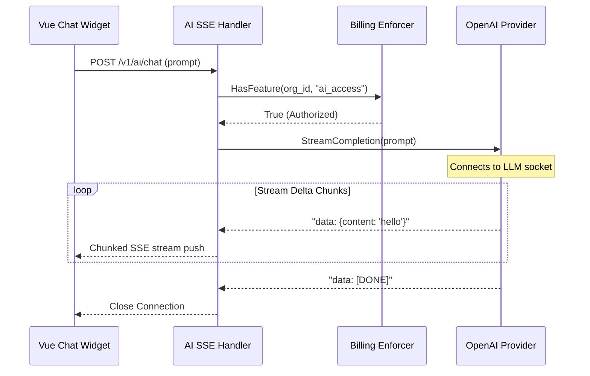

# AI Integration & Streaming completions

EntSaaS features a robust, multi-provider AI engine capable of streaming interactive LLM completions to front-end chat interfaces via Server-Sent Events (SSE).

---

## 1. Multi-Provider AI Protocols

All third-party language model operations are decoupled using clean Go interface abstractions defined in `/internal/ai/`:
- **OpenAI Engine**: Connects to official OpenAI servers or OpenAI-compatible gateways.
- **Switchable Providers**: Out-of-the-box configurations support Azure OpenAI, local Ollama endpoints, and self-hosted vLLM servers.

---

## 2. Server-Sent Events (SSE) Streaming

For high-quality responsive chatbot user experiences, EntSaaS leverages HTTP chunked SSE transfers to deliver prompt deltas immediately:

### Key Source Files:
- [ai.go:36](internal/handlers/ai.go#L36): Backend Server-Sent Events chat stream router managing client HTTP stream states and flushing delta completions.
- [AiChatWidget.vue](web/src/components/ai/AiChatWidget.vue): Client UI widget listening to event streams and mapping reactive chats smoothly.
