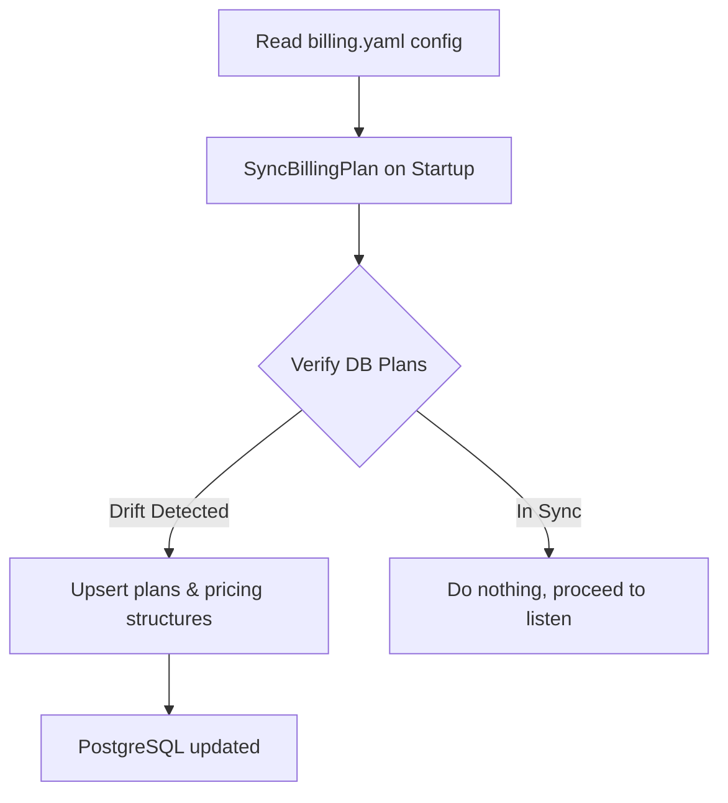

# Declarative Catalog & Billing Engine

EntSaaS features a highly scalable, metadata-driven billing engine that isolates plan management from application business logic. Plans, pricing tiers, resource quotas, and feature flags are defined in a single file: `config/billing.yaml`.

---

## 1. The Declarative Catalog (`billing.yaml`)

Your framework features a declarative, structural catalog. The configuration is defined as follows:

```yaml
plans:
  - id: plan_free
    name: Free Tier
    features:
      - ai_access: false
    limits:
      max_projects: 1
      max_members: 1
  - id: plan_pro
    name: Pro Tier
    features:
      - ai_access: true
    limits:
      max_projects: 10
      max_members: 5
```

---

## 2. Dynamic Plan Reconciler Flow

The plan catalog is synchronized with the database dynamically on startup:



### Key Source Files:
- [sync.go](internal/store/sync.go): Compares database states with the local YAML catalog and updates DB plan versions dynamically on server initialization.

---

## 3. Real-Time Quota Enforcement

The backend billing enforcer ([enforcer.go](internal/billing/enforcer.go)) blocks resource allocations and gates features based on active subscription records:

### 3.1 Project Quotas
Evaluated in [projects.go:35](internal/handlers/projects.go#L35):
```go
if err := h.enforcer.CheckProjectLimit(c, orgID); err != nil {
    c.JSON(http.StatusForbidden, gin.H{"error": "Project limit reached. Please upgrade your plan."})
    return
}
```

### 3.2 Member Quotas
Evaluated in [invites.go:47](internal/handlers/invites.go#L47) and [auth.go:142](internal/handlers/auth.go#L142):
```go
if err := h.enforcer.CheckMemberLimit(c, orgID); err != nil {
    c.JSON(http.StatusForbidden, gin.H{"error": "Member seat limit reached. Please upgrade your plan."})
    return
}
```

### 3.3 Feature Gates
Evaluated dynamically before processing expensive operations (such as calling AI completions in [ai.go:51](internal/handlers/ai.go#L51)):
```go
if !h.enforcer.HasFeature(c, orgID, "ai_access") {
    c.JSON(http.StatusForbidden, gin.H{"error": "AI Access is not enabled on your current plan."})
    return
}
```
