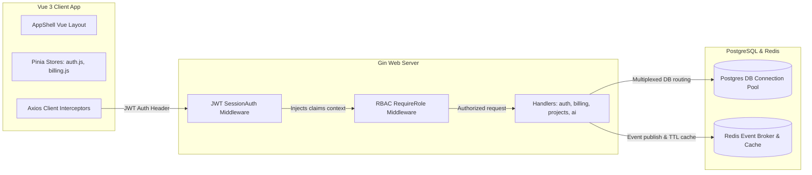

# System Overview

This section covers the core backend and frontend architecture of the EntSaaS framework.

---

## Key Component Layout

### 1. The Request Pipeline
1. The **Vue 3 Client** dispatches HTTP requests via a central Axios wrapper.
2. The request is intercepted by the **`SessionAuth()`** middleware, which extracts and validates JWT access claims.
3. The **`RequireRole()`** middleware asserts the user's role satisfies endpoint rules (e.g. only Admins can create team invitations).
4. Handlers fetch DB pools via the **Tenant Router** and return structured JSON or stream Server-Sent Events (SSE).

### 2. Database Connection Pooling
EntSaaS leverages `pgx` with integrated connection pools. Every database action is executed under org-isolated contexts, ensuring robust multi-tenant data segmentation.

### 3. Asynchronous Events & Caching
Redis Streams are used to decouple long-running operations (e.g., triggering invitation emails or executing billing reconciliations) from the core request-response thread, while the store cache handles high-performance TTL data retrieval.
