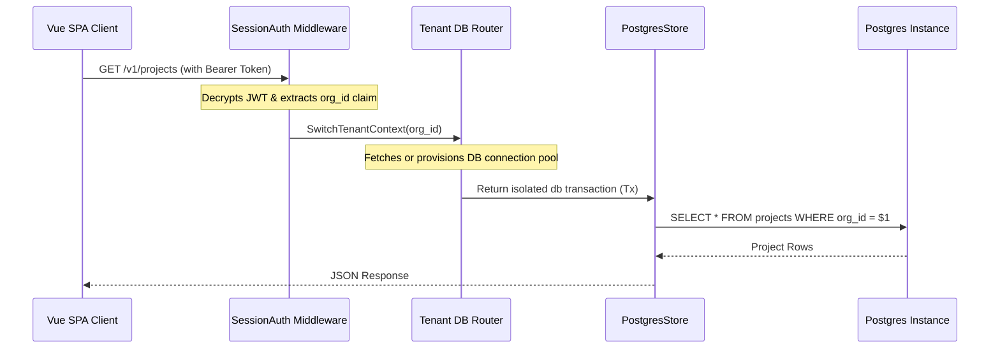

# Multi-Tenancy Architecture

Multi-tenant isolation is the most critical safety barrier of a SaaS platform. EntSaaS implements multi-tenant isolation at the database layer, ensuring no organization can ever read or modify another tenant's data.

---

## 1. Database Segmentation Strategy

EntSaaS supports two primary strategies for multi-tenant data isolation:

### 1.1 Shared Database, Shared Schema (Column-Level Separation)
This is the default and most cost-effective deployment mode.
- All tenant records reside in shared tables (e.g. `projects`, `users`, `invites`).
- Every multi-tenant table contains an `org_id` column.
- The PostgreSQL query layer automatically scopes all SELECT/UPDATE/DELETE operations to the request's active `org_id`.

### 1.2 Sharded Databases (Database-Level Separation)
For high-security or enterprise deployments, EntSaaS contains a dynamic **Tenant Router** (`tenant_router.go`) capable of switching databases at runtime.

---

## 2. Dynamic Connection Routing Flow

The routing lifecycle flows as follows:

### Key Source Files:
- [tenant_router.go](internal/store/tenant_router.go): Dynamic db resolver switching connection pools based on injected organization context.
- [projects.go:21](internal/handlers/projects.go#L21): Handlers fetch scoped store transactions and load projects filtered specifically by current organization claims.
